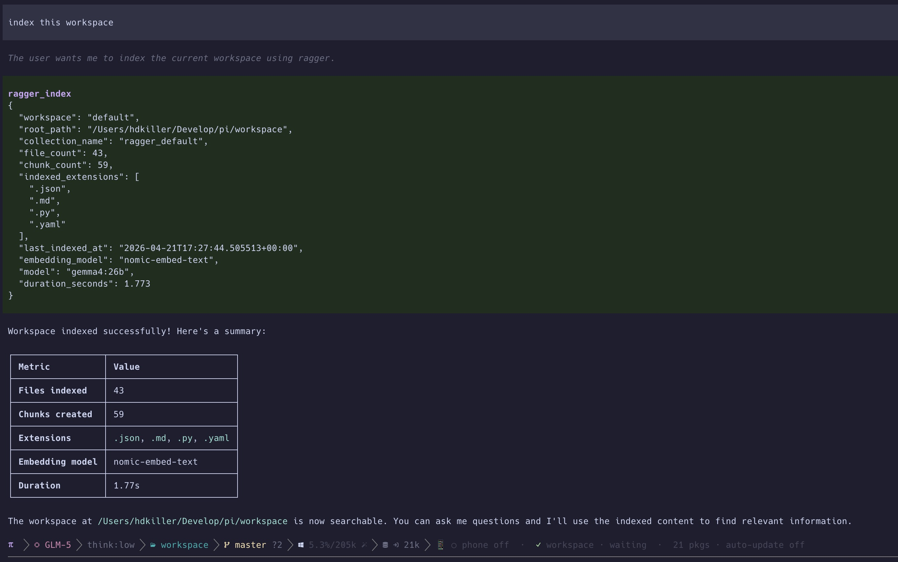
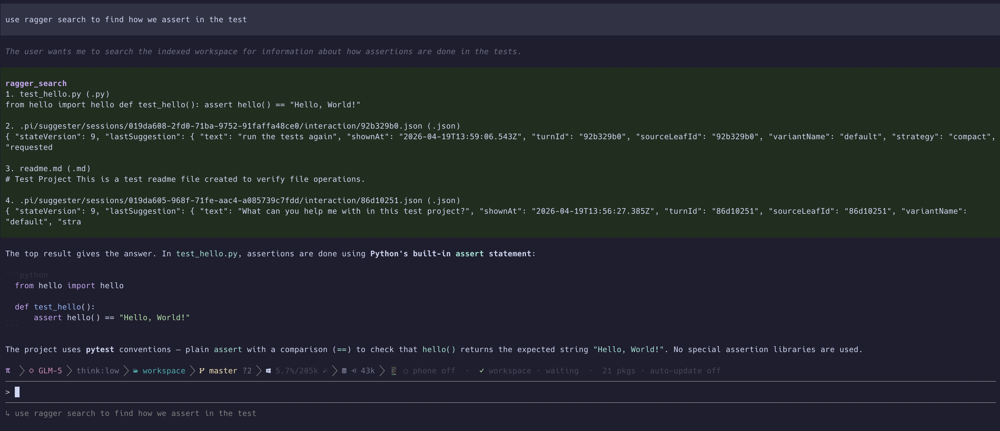

# 🗄️ ragger

[](https://www.python.org/downloads/release/python-390/)
[](https://fastapi.tiangolo.com)
[](https://github.com/psf/black)
[](#)

Local multi-workspace RAG for codebases and docs. Built with **Chroma**, **Ollama**, **FastAPI**, and a terminal-first **Textual TUI**.

`ragger` provides a unified local retrieval stack accessible via three primary interfaces:
- 🖥️ **Textual TUI**: Interactive workspace management and real-time result exploration.
- 🚀 **FastAPI Server**: Seamless integration for external clients, Pi extensions, and editor tooling.
- ⌨️ **CLI**: Scriptable indexing, search, and system statistics.

---

## 📑 Table of Contents
- [Highlights](#-highlights)
- [Quick Start](#-quick-start)
- [Interfaces](#-interfaces)
  - [Textual TUI](#textual-tui)
  - [FastAPI Server](#fastapi-server)
  - [CLI](#cli)
  - [API Usage (curl)](#-api-usage-curl)
- [Pi Extension](#-pi-extension)
- [Development](#-development)
- [Screenshots](#-screenshots)

---

## ✨ Highlights

- **100% Local**: Ollama-backed chat and embeddings ensure your data stays on your machine.
- **Multi-Workspace**: Index and query multiple repositories or docsets independently.
- **Deep Inspection**: View retrieval hits and metadata directly within the TUI.
- **Extensible**: Standardized FastAPI endpoints for building custom integrations.
- **Smart Filtering**: Automatically skips `node_modules`, `.git`, and build artifacts.

---

## 🚀 Quick Start

### 1. Installation
```bash
python3 -m venv .venv
source .venv/bin/activate
pip install -e .
```

### 2. Prepare Ollama
Ensure [Ollama](https://ollama.com/) is running and pull the required models:
```bash
ollama pull gemma4:26b
ollama pull nomic-embed-text
```

### 3. Launch & Index
Start the TUI to begin indexing your first workspace:
```bash
ragger-tui
```
Inside the TUI, use the command: `/ingest default /path/to/repo`

---

## 🛠️ Interfaces

### Textual TUI
The primary way to interact with your workspaces. Features a command console and a results panel.
```bash
# Launch via module or script
python3 -m ragger.tui
# or
ragger-tui
```

### FastAPI Server
Exposes the retrieval engine over HTTP. Default: `http://127.0.0.1:8170`
```bash
ragger-server
```
- **Interactive Docs**: [/docs](http://127.0.0.1:8170/docs) (Swagger) or [/redoc](http://127.0.0.1:8170/redoc)
- **OpenAPI Spec**: Available at `docs/openapi.json`

### CLI
Perfect for quick searches or background scripts.
```bash
ragger-cli index default /path/to/repo
ragger-cli search default "Where is the auth logic?"
```

### 🌐 API Usage (curl)
For detailed API examples, including workspace management and direct search via `curl`, see the [**Usage Guide**](docs/usage.md).

---

## 🥧 Pi Extension
Connect **Pi** through the bundled `pi-ragger` extension. Ensure the `ragger-server` is running first:
```bash
pi -e ./pi-ragger/index.ts
```

---

## 🧪 Development

### Running Tests
```bash
PYTHONPYCACHEPREFIX=/tmp/pycache .venv/bin/python -m unittest discover -s tests/unit -v
```

### Code Formatting
```bash
black ragger tests/unit scripts
```

### Commit Convention
We use **Semantic Commits**: `type(scope): summary` (e.g., `feat(server): add status endpoint`).

---

## 📸 Screenshots

**Workspace Indexing in the TUI**


**Querying the RAG engine**

